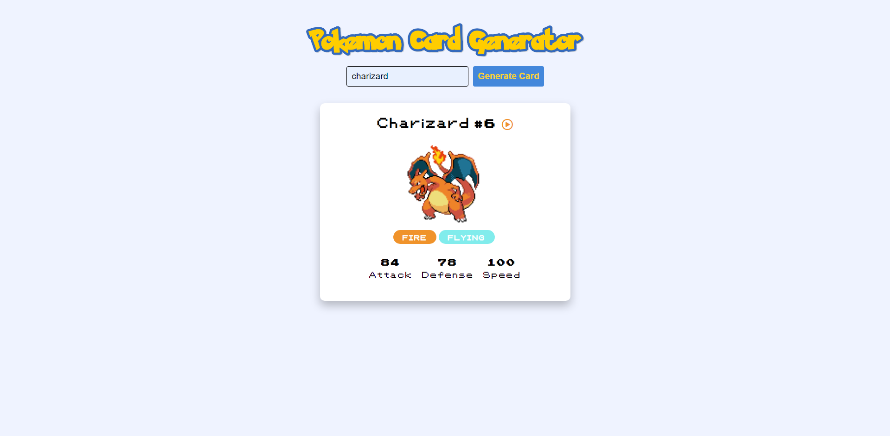

# Pokemon Card Generator

Pokemon is one of the most popular media franchises, consisting of video games, animated TV series and films, trading card games, and other media. The creatures in these games, known as Pokemon, go way back to the first two Pokemon games, Pokemon Red and Pokemon Green, and hundreds of Pokemon have been created since then. This repository contains the code for a simple web application that generates Pokemon cards featuring the Pokemon's name, ID number, cry, sprite, type(s), and base statistics based on the user's input. The <a href="https://pokeapi.co/" target="_blank">Poke API</a> is used to retrieve the data.

## Features

- **PokeAPI**: The PokeAPI is used to retrieve the appropriate data that is being displayed for the Pokemon cards.
- **Pokemon-Inspired Font**: The font used for the Pokemon cards is inspired by the font used in the older Pokemon games. The font for the title is inspired by the Pokemon logo.
- **Sound Effects**: The Pokemon's cry can be played by clicking the play button.
- **Responsive Design**: The website is designed to be responsive so that it can be viewed on a variety of devices.

## Core Files

- `index.html`: The main HTML file that contains the components of the webpage, including the title, search bar, button to generate cards, and the cards themselves.
- `style.css`: The CSS file that contains the styling for the webpage along with media queries for responsiveness.
- `script.js`: The JavaScript file that contains the logic for the webpage so that the Pokemon cards are generated with the correct information based on the user's input.
- `icon.png`: The icon that is displayed on the tab of the browser.
- `font.ttf`: The Pokemon-inspired font used for the Pokemon cards.

## How to Run

1. Download the files from this repository.
2. Open `index.html` in a browser.
3. Enter a Pokemon's name in the search bar and click the button to generate the card.

## Credits

This project was made possible with the PokeAPI and the Pokemon-inspired Font.